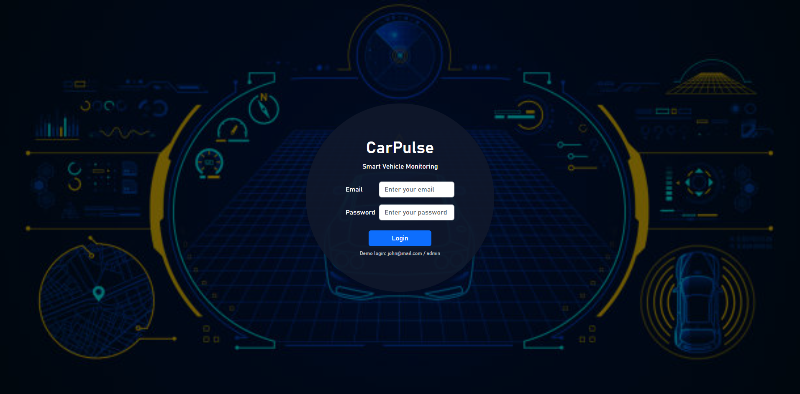
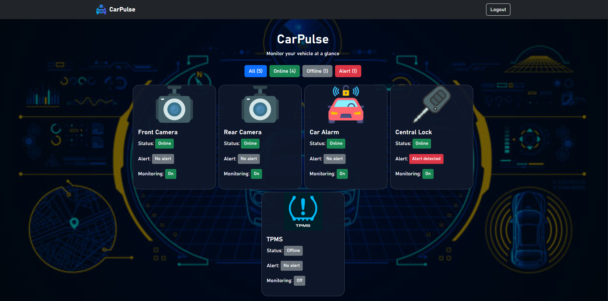

# CarPulse

A smart vehicle monitoring dashboard built with React and React Bootstrap.

CarPulse allows users to quickly view their vehicle device status, alerts, and monitoring settings from one dashboard.

Image 1: Login page.

Image 2: Dashboard page.

Image 3: Custom 404 Error Page.

## Features

- User login authentication
- Admin and Guest user roles
- Protected Dashboard route
- React Router navigation
- Custom 404 Error Page
- Device status monitoring
- Alert status display
- Manual Monitoring On/Off control
- Filter devices by:
  - All
  - Online
  - Offline
  - Alert

## Tech Stack

- React
- Vite
- JavaScript
- React Router
- React Bootstrap
- Bootstrap 5
- JSON
- CSS
